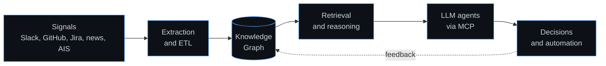

  

 

  

 

## 🧠 About

I build AI systems that take machine learning from research into production. My work sits across agent infrastructure, knowledge graphs, and the automation that keeps data and model pipelines running on their own.

## ⚡ What I work on

🤖 Agentic AI systems with LLMs, retrieval, and the Model Context Protocol

🕸️ Knowledge graphs and memory layers that give agents real context

⚙️ Automation for ML pipelines, from ingestion to training to deployment

🔬 Deep learning research on biomedical and time series data

## 🚀 Current focus

Right now I am extending the multi agent framework behind [askmystack.space](https://askmystack.space): memory persistent sub agents that trigger each other through Kafka events and reason over a Neo4j graph. On the research side I am studying how agent memory and retrieval change the way models stay grounded over long horizons.

## 🧰 Tech I reach for

 

 

  

## 🗺️ How my systems fit together

A pattern runs through most of what I build: turn messy signals into a graph, reason over it, and let agents act on the result.

## 📚 What I am reading

Notes I keep coming back to while building agent systems:

📄 Foundational LLMs and text generation, from tokenization to inference

📈 Chinchilla and compute optimal scaling for model and data size

🧩 Agent architectures: extensions, functions, and data stores

🔌 The Model Context Protocol and how agents reach tools and memory

🔎 Retrieval and grounding, and how RAG keeps evolving

## 🎯 Good first issues

If you want to contribute to the portfolio, these are good places to start in
this profile repo:

- [#3 Enable Dependabot on all Python and Node repos](https://github.com/askmy-stack/askmy-stack/issues/3)
- [#9 Shared SECURITY.md template for API key and PII handling](https://github.com/askmy-stack/askmy-stack/issues/9)
- [#16 Embed snake contribution graph SVG in profile README](https://github.com/askmy-stack/askmy-stack/issues/16)
- [#17 Add repository description and GitHub topics](https://github.com/askmy-stack/askmy-stack/issues/17)
- [#24 Cross-repo issue redirect template](https://github.com/askmy-stack/askmy-stack/issues/24)

You can also browse the full
[good first issue list](https://github.com/askmy-stack/askmy-stack/issues?q=is%3Aissue+is%3Aopen+label%3A%22good+first+issue%22).

  

