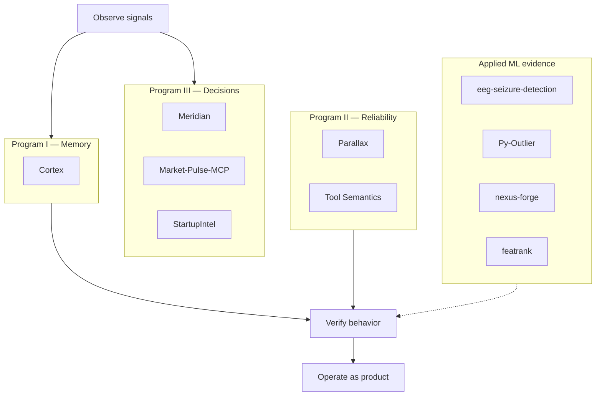

# Abhinaysai Kamineni

**Developer · Product Researcher · AI Systems Builder**

## Research thesis

Most AI failures are not model failures. They are failures of **context**, **observability**, **evaluation**, and **recovery**.

I build systems that investigate those boundaries: organizational memory for agents, behavioral compatibility testing for tools, runtime reliability for autonomous systems, and intelligence products built from noisy real-world streams. The work moves through a repeatable loop — **observe signals, structure understanding, verify behavior, operate as product** — not a stack of disconnected repos.

---

## Research programs

### I — Memory and context

**Question:** How can agents retain organizational knowledge without becoming stale or ungrounded?

| Artifact | Role |
|----------|------|
| [**Cortex**](https://github.com/askmy-stack/cortex) | Captures decisions from Slack, GitHub, Jira, and manual input into a temporal knowledge graph; serves context over MCP and REST |
| **Hypothesis** | Decision lineage in a graph beats flat chat history for multi-agent grounding |
| **Evidence** | Trust scoring, contradiction detection, supersession chains, extraction pipeline |

### II — Reliable autonomous systems

**Question:** Can an agent detect degradation *before* visible task failure — and distinguish interface drift from runtime drift?

| Artifact | Role |
|----------|------|
| [**Parallax**](https://github.com/askmy-stack/parallax) | Runtime reliability: failure taxonomy, semantic monitoring, recovery policies (AgentFailBench) |
| [**Tool Semantics**](https://github.com/askmy-stack/tool-semantics) | Interface reliability: behavioral probes and compatibility testing for MCP tools — when a change breaks the *agent*, not just the schema |
| **Hypothesis** | Reliability requires both runtime diagnosis and contract-level behavioral verification |
| **Evidence** | Failure injectors, root-cause label schema, change-code catalog, experiment reports |

### III — Signals into decisions

**Question:** How do incomplete, high-velocity signals become defensible decision products?

| Artifact | Role |
|----------|------|
| [**Meridian**](https://github.com/askmy-stack/meridian) | Geopolitical and AIS vessel signals → supply-chain risk knowledge graph |
| [**Market-Pulse-MCP**](https://github.com/askmy-stack/Market-Pulse-MCP) | Real-time market streams → MCP skill server for agent-consumable intelligence |
| [**StartupIntel**](https://github.com/askmy-stack/startupintel) | Specialized ML bots over startup data with graph-backed retrieval |
| **Hypothesis** | Streaming ingestion + graph structure turns noise into queryable decision context |
| **Evidence** | Pipeline health endpoints, anomaly detection, agent workflow docs |

---

## Case studies

<strong>Cortex — organizational memory as a product surface</strong>

- **Observed problem:** Agents and teams lose decisions across Slack threads, PRs, and ephemeral sessions.
- **Built:** Kafka event bus → extraction worker → Neo4j graph → MCP (`cortex_query`, `cortex_inject`, `cortex_remember`).
- **Research angle:** Temporal memory with provenance, trust, and explicit contradiction handling — not a vector dump.
- **Product outcome:** Shared context layer multiple agents can query with role-aware access.

→ [Architecture](https://github.com/askmy-stack/cortex/blob/main/ARCHITECTURE.md) · [Research foundation](https://github.com/askmy-stack/cortex#research-foundation)

<strong>Parallax + Tool Semantics — reliability as a research program</strong>

- **Observed problem:** Autonomous systems fail invisibly; schema-valid tool changes still break agent behavior.
- **Built:** Failure injection interfaces, benchmark ladder, behavioral probes, and compatibility exit codes for CI.
- **Research angle:** Separate *runtime* degradation (Parallax) from *interface* drift (Tool Semantics); evaluate both before shipping.
- **Product outcome:** Test harnesses and policies agents and platforms can adopt before production.

→ [Failure taxonomy](https://github.com/askmy-stack/parallax/blob/main/docs/failure-taxonomy.md) · [Change codes](https://github.com/askmy-stack/tool-semantics/blob/main/docs/change-codes.md)

<strong>Applied ML evidence — benchmarks over demos</strong>

| Repository | What it validates |
|------------|-------------------|
| [**eeg-seizure-detection**](https://github.com/askmy-stack/eeg-seizure-detection) | 15+ architectures on 916h pediatric EEG (CHB-MIT) |
| [**Py-Outlier**](https://github.com/askmy-stack/Py-Outlier) | Statistical + ML anomaly detection on structured data |
| [**Nexus Forge**](https://github.com/askmy-stack/nexus-forge) | Multimodal summarization with grading loop and MCP serving |
| [**FeatureRank**](https://github.com/askmy-stack/featrank) | Semantic dedup and priority ranking for product feature requests |

---

## Portfolio map

```mermaid
flowchart TB
    subgraph memory["Program I — Memory"]
        C[Cortex]
    end
    subgraph reliability["Program II — Reliability"]
        P[Parallax]
        TS[Tool Semantics]
    end
    subgraph decisions["Program III — Decisions"]
        M[Meridian]
        MP[Market-Pulse-MCP]
        SI[StartupIntel]
    end
    subgraph evidence["Applied ML evidence"]
        EEG[eeg-seizure-detection]
        PO[Py-Outlier]
        NF[nexus-forge]
        FR[featrank]
    end

    OBS[Observe signals] --> memory
    OBS --> decisions
    memory --> VERIFY[Verify behavior]
    reliability --> VERIFY
    VERIFY --> PROD[Operate as product]
    evidence -.-> VERIFY
```

---

## Methods

**Research:** behavioral probes · controlled failure injection · benchmark design · ablation studies · semantic evaluation · time-series experimentation

**Engineering:** event-driven pipelines · knowledge graphs · MCP interfaces · stream processing · observability · reproducible ML pipelines

---

## Principles

1. Systems should expose uncertainty, not hide it behind confident outputs.
2. Agent **behavior** matters more than schema compatibility alone.
3. Memory requires provenance, time, and contradiction handling.
4. Benchmarks should reproduce failure modes — not only report accuracy.
5. Research earns its keep when it survives contact with a product.

---

## Selected repositories

| Domain | Repositories |
|--------|--------------|
| Agent memory | [cortex](https://github.com/askmy-stack/cortex) · [job-search-pipeline](https://github.com/askmy-stack/job-search-pipeline) |
| Reliability | [parallax](https://github.com/askmy-stack/parallax) · [tool-semantics](https://github.com/askmy-stack/tool-semantics) |
| Decision intelligence | [meridian](https://github.com/askmy-stack/meridian) · [Market-Pulse-MCP](https://github.com/askmy-stack/Market-Pulse-MCP) · [startupintel](https://github.com/askmy-stack/startupintel) |
| Applied ML | [eeg-seizure-detection](https://github.com/askmy-stack/eeg-seizure-detection) · [Py-Outlier](https://github.com/askmy-stack/Py-Outlier) · [nexus-forge](https://github.com/askmy-stack/nexus-forge) · [featrank](https://github.com/askmy-stack/featrank) |
| Product surface | [askmy-space](https://github.com/askmy-stack/askmy-space) |

---

[Portfolio](https://askmystack.space) · [LinkedIn](https://linkedin.com/in/abhinaysai-kamineni) · [GitHub org](https://github.com/askmy-stack)

*Open to research collaborations on agent memory, reliability, and decision systems.*

