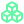

  

<h1>ABHINAYSAI KAMINENI</h1>

<samp>AI SYSTEMS ENGINEER // RESEARCHER</samp>

<samp>CONTEXT &rarr; ORCHESTRATION &rarr; EXECUTION &rarr; AUTONOMY</samp>

---

###  <samp>01 // PERSPECTIVE</samp>

> **Models predict. Agents deliver. Systems anchor context.**

---

###  <samp>02 // OPERATING LAYERS</samp>

| Layer | Focus |
| :--- | :--- |
| `CONTEXT` | Preserve the state and evidence that shape a decision. |
| `ORCHESTRATION` | Coordinate models, tools, data, and actions into one continuous flow. |
| `EXECUTION` | Examine what the system actually does, not only what it intended to do. |
| `RELIABILITY` | Detect degradation early, recover deliberately, and continue with context. |
| `LEARNING` | Resolve complex temporal and spatial data into grounded signals. |

---

###  <samp>03 // SYSTEM STACK</samp>

<samp>INTELLIGENCE LAYER</samp>

    <samp>LLM SYSTEMS</samp>

<samp>INTERFACE LAYER</samp>

   

<samp>MEMORY LAYER</samp>

   

<samp>OPERATIONS LAYER</samp>

     

---

###  <samp>04 // TRANSMISSION</samp>

    

